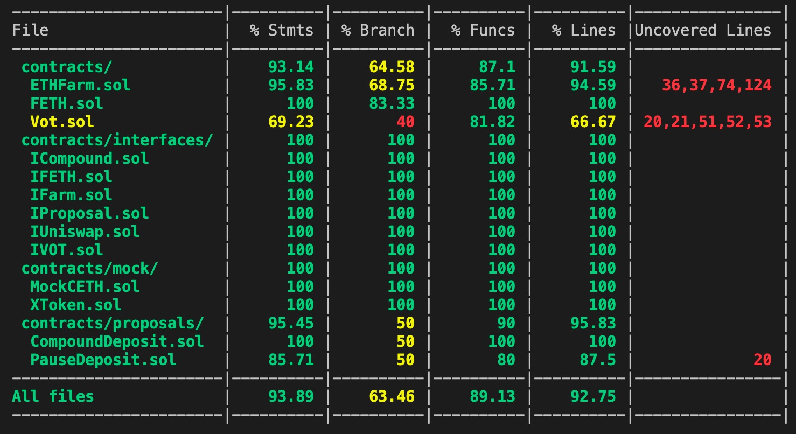

## ropsten 

FETH: 0xAD3cD0e1762f91708AD648b84b690FA72fFe1BB9

VOT: 0x459a6165589a1F6C3c24F86DB4a27462cc880a31

Farm: 0x063bD7E568A822eE74fA6eA1Ee260bd0466ACF6D

OpenDeposit: 

PauseDeposit: 

CompoundDeposit: 0x810c3Fd4F95C56D26280e682072ed37B59114229

cETH: 0xbe839b6d93e3ea47effcca1f27841c917a8794f3

## Teset report


## Farm function

### 1. 投票通过提案 
```javascript
//proposal 提案合约地址 ps:投票率超过66%提案通过
function vote(address proposal) external nonReentrant returns (bool status, uint256 votes)
```

### 2. 投票结束提案
```javascript
//proposal 提案合约地址
function unActiveVot(address proposal) external
```

### 3. 当前提案数量
```javascript
//length 当前提案数量
function getProposalNumber() external view returns (uint256 length)
```

### 4. 根据索引读取提案
```javascript
//index 根据索引读取提按状态
function getProposalByIndex(uint256 index) external view returns (address proposal, bool status, uint256 votes, uint256 expired))
```

### 5. 根据提案地址读取提案
```javascript
///proposal 提案合约地址
function getProposal(address proposal) external view returns (bool status, uint256 votes, uint256 expired)
```

### 6. 投资
```javascript
//amountFETH 投入的FETH数量, 投资人通过暂停投资的提案后无法投资。需要等待开启投资的提案通过后才能继续投资
function deposit(uint256 amountFETH) external nonReentrant whenNotPaused returns (uint256 liquidity)
```
### 4. 提现
```javascript
//amountVOT 要提现的VOT数量
function withdraw(uint256 amountVOT) external nonReentrant returns (uint256 withdrawAmount)
```
## Proposal function 
```javascript
//合约状态是否激活
bool public status;
//合约提案请求的投资额
uint256 public INVEST_ETH = 11e15;
//合约提案摘要
string public SUMMARY = "proposal for deposit to compound";
```
